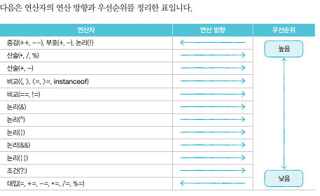

4가지 키워드
연산자:연산의 종류를 결정짓는 기호를 말합니다. 연산자으 종류는 산술(+,-,*,/,%), 증감(++,--), 비교(==,!=,...), 논리(&&,||,...), 대입(=,+=,-=,...)등이 있습니다.
피연산자:연산식에서 연산되는 데이터(값)를 말합니다. 예를 들어, 연산식3+x에서는 3과 변수x가 피연산자입니다.
연산방항:연산식에서 같은종류의 연산자가 여러 개 사용될 경우 왼쪽에서 오른쪽으로 또는 오른쪽에서 왼쪽으로 연산되는 방향이 있습니다. 대부부의 연산자는 왼쪽에서 오른쪽으로 연산이 되지만,증감(++,--)과 대입(=,+=,-=)은 오른쪽에서 왼쪽으로 연산됩니다.
연산우선순위:서로다른연산자들이 복합적으로 구성되면 우선적으로 연산되는 연산자가 있습니다.하지만 괄호()로 감싼 연산이 최우선순위를 갖기 때문에 복잡한 연산식에서 연산의 순서를 정하고 싶을때에는 괄호()를 활용하세요. 
표로 정리하는 핵심 포인트
