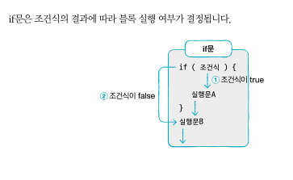
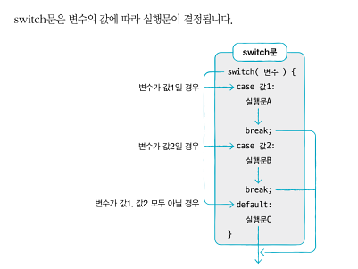

4가지 키워드
if문:if(조건식) {...}을 말하며 조건식이 true가 되면 증괄호 내부를 실행합니다.
if-else문:if(조건식){...}else{...}를 말하며 조건식이 true가 되면 if 중관로 내부를 실행하고, false가 되면 else 중괄호 내부를 실행행 합니다.
if-else if-else 문:if(조건식1) {...} else if(조건식2) {...} else {...}를 말하며 조건식1이 true가 되면 if중괄호 내부를 실행하고, 조건식2가 true가 되면 else if 중괄호 내부를 실행합니다. 조건식1과 조건식2가 모두 flase가 되면 else 중괄호 내부가 실행됩니다.
switch문:switch(변수) {case 값1:... case 값2: ... default: ...}를 말하며 변수의 값이 값1이면 첫 번째 case 코드를 실행하고, 값2이면 두 번째 case 코드를 실행합니다. 값1과 값2가 모두 아니면 defult코드를 실행합니다.
그림으로 정리하는 핵심 포인트 

